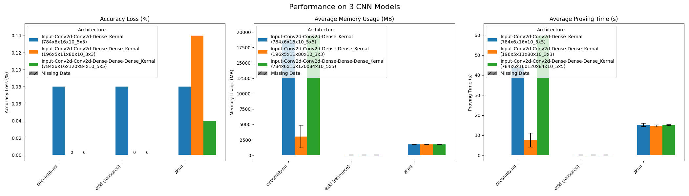
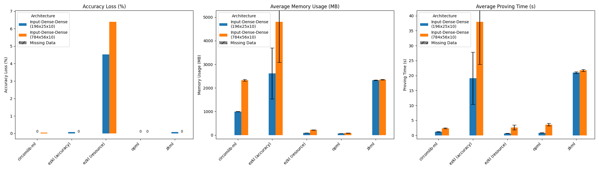
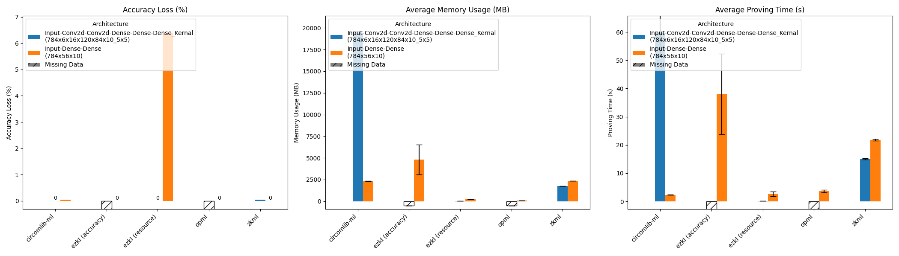

> **Disclaimer**: The benchmark settings for each framework have been determined solely based on my interpretation of their respective documentation and codebases. It is possible that misinterpretations have occurred, potentially leading to suboptimal environment configurations, improper testing data preprocessing, or incorrect parameter selection. Consequently, these factors may have influenced the accuracy of the benchmark results. If you detect any such errors or unexpected results, please do not hesitate to contact me via my Telegram account @Guy1m0. I am eager to address any inaccuracies to ensure the benchmarks presented are as reliable and comprehensive as possible. 

# Introduction

As machine learning continues its expansion in the global market, the reliability and integrity of its models have become paramount. This is especially true in the context of Machine Learning as a Service (MLaaS), where there's an inherent need to ensure **model authenticity**, which means guaranteeing that the offered model not only matches its description but also operates within accurate parameters while maintaining a degree of privacy. To achieve this, zk-SNARK (Zero-Knowledge Succinct Non-Interactive Argument of Knowledge) has garnered significant attention. Its ability to produce short proofs, regardless of the size of the input data, makes it a prime candidate for integration with ML frameworks like EZKL and Daniel Kang's zkml. However, the challenge of translating ML models into circuits optimized for zero-knowledge-proof systems is non-trivial, particularly for complex neural networks.

Consequently, progress has been made in crafting custom circuits using existing architectures, like zk-STARK, Halo2, and Plonk2. Although these custom circuits can accommodate the sophisticated operations of modern ML models, they often fall short of being scalable, generalized solutions. This situation presents developers with a dilemma: selecting the framework that best suits their specific needs.

To address this issue, I'm developing a zkML benchmark. This tool is designed to assist developers in understanding the trade-offs and performance differences among various frameworks. While many frameworks offer their own benchmark sets, making direct comparisons is complex due to the numerous variables that affect performance. My approach focuses on establishing uniform conditions across all frameworks to provide a practical and straightforward comparison.

Unlike the existing benchmark [results](https://blog.ezkl.xyz/post/benchmarks/) conducted by the team at EZKL, which focus on traditional machine learning models including Linear Regression, Random Forest Classification, Support Vector Machine (SVM), and Tree Ensemble Regression, our benchmarks analyze selected zkML frameworks with an emphasis on networks that include **deep neural networks** (DNNs) and **convolutional neural networks** (CNNs).

# Benchmark Overview

This project has executed extensive testing over several months, evaluating 4 leading zkML frameworks against **6 different DNN and CNN architectures**. Through meticulous analysis of each framework across **2500 datasets**, we have invested **over 250 hours** in setup and proof generation. The exhaustive results for each configuration are meticulously documented in the [csv](https://github.com/Guy1m0/ZKML-Benchmark/blob/main/benchmarks/benchmark_results.csv), providing a comprehensive resource for comparison.

For example, the '784_56_10' DNN model begins with an input size of 784, progresses through a dense layer of 56 units, and concludes with a 10-class output. This model, among others, was tested to understand the frameworks' efficiency and effectiveness. The following table provides a snapshot of the benchmark results:

| Framework                | Accuracy Loss (%) | Avg Memory Usage (MB) | Std Memory Usage | Avg Proving Time (s) | Std Proving Time | Notes                                     |
|--------------------------|-------------------|-----------------------|------------------|----------------------|------------------|-------------------------------------------|
| circomlib-ml (tensorflow)| 0.04              | 2328.32               | 34.44            | 2.35                 | 0.15             | non-linear constraints: 73416           |
| ezkl (pytorch)           | 0.00              | 4807.18               | 1719.09          | 38.01                | 14.24            | mode=accuracy \| Combined 0-2500       |
| ezkl (pytorch)           | 6.40              | 220.90                | 3.85             | 2.66                 | 0.79             | mode=resources                          |
| opml (pytorch)           | 0.00              | 89.32                 | 2.47             | 3.60                 | 0.43             |                                           |
| zkml (tensorflow)        | 0.00              | 2355.05               | 11.75            | 21.73                | 0.32             | Combined 0-2500                          |

## Primary Metrics

* **Accuracy Loss:** Measures how well the inference generated by each frameworks retains the same prediction generated by original neural network. Lower accuracy loss is preferable.

* **Memory Usage:** Tracks the peak memory consumption during proof generation, indicating the system's resource demand.

* **Proving Time:** The time required by each framework to generate a proof, essential for gauging the proof system's efficiency. Note: Proof verification time is considered beyond the scope of this analysis.

**Note:** In the above table, "Std Proving Time" and "Std Memory Usage" represent the standard deviation of time taken to generate proofs and memory used during tests, respectively, offering insights into the efficiency and consistency of each framework.

# Benchmark Methodology

The methodology for benchmarking zkML frameworks is meticulously designed to evaluate and compare the performance and capabilities of various zk proof systems for verifiable inference. 

## Selected Frameworks:

- **EZKL (Halo 2)**
- **ZKML (Halo 2)**
- **Circomlib-ml (R1CS Groth16)**
- **opML (Fraud Proof)**

These frameworks were selected based on criteria such as GitHub popularity, the proof system used, and support for different ML model formats. This variety ensures a broad analysis across distinct zk proof systems.

> Orion Exclusion: The proof generation process for Orion, developed by Gizatech, is executed on the Giza platform. Due to this, the memory usage and time cost metrics during proof generation are not directly comparable with those of other frameworks evaluated in this project. As a result, to maintain the integrity and comparability of our benchmarking analysis, Orion's benchmark results will be excluded from the subsequent sections.

## Benchmarking Design
Our benchmarking involves tasks on the MNIST dataset for evaluating frameworks under varying complexity levels:

* **MNIST Dataset:**
    - Simplicity of Task: The MNIST dataset, comprising handwritten digits, serves as a benchmark for assessing the basic capabilities of zkML frameworks.
    - Framework Assessment: This task will gauge how each framework manages simple image data in terms of maintaining accuracy and operational efficiency.
    - Parameter Variation: The frameworks will be tested on this dataset with an increasing number of parameters and layers, pushing the boundaries of each framework's capacity.


The benchmarking process for evaluating zkML frameworks is designed to offer a thorough analysis of their performance across various metrics. Below is a detailed outline of the steps involved.

1. **Neural Network Design:** 
    * To rigorously assess the capability of each framework in translating neural networks into zk circuits, I have designed six distinct models, spanning from 3-layer DNNs to 6-layer CNNs. These models are specifically chosen to represent two different scales of complexity, with approximately **5,200 and 44,500 trainable parameters** respectively. This approach not only tests the frameworks' efficiency in the transpilation process but also their ability to handle models of varying complexities effectively.

2. **Uniform Testing Conditions:** 
    * Given the diversity in zkML framework compatibilities, with some frameworks exclusively supporting TensorFlow or PyTorch, establishing uniform testing conditions extends beyond merely standardizing the structures. To achieve direct and equitable performance comparisons, it's essential to unify model representations across the TensorFlow and PyTorch ecosystems. This harmonization is crucial for accurately reflecting each framework's performance under comparable conditions.

    * Given the limitations of existing conversion tools like the ONNX framework, which struggles with seamless model transitions between TensorFlow and PyTorch, a manual approach was adopted. This entails defining identical neural network architectures within each framework's preferred environment and carefully **transferring weights and biases** in a manner that aligns with the computational paradigms of both TensorFlow and PyTorch. This meticulous process, which includes adjusting for differences in computational paradigms—such as transposing weights in PyTorch before matrix application—ensures a fair and substantive comparison. By doing so, we can more accurately assess proving time, memory usage, and accuracy loss across different zkML frameworks. 

3. **Exclusion of Pre-Processing Steps:** 
    * Our measurements concentrate exclusively on the **proof generation phase**, deliberately omitting data pre-processing or system setup steps. Given the varied implementation languages (e.g., Rust and Golang), zk systems (e.g., fraud proof, zk-SNARK, Halo2), and neural network libraries (e.g., TensorFlow, PyTorch) across frameworks, focusing solely on proof generation allows us to eliminate external variables that could influence the benchmarking results. This decision underscores our commitment to a benchmarking methodology that isolates and evaluates the core function of zkML frameworks, ensuring a clear and unbiased comparison of their performance.


4. **Comparative Performance Analysis:** 
    * Performance is compared both horizontally and vertically, examining the impact of variations in network structure on critical metrics like proof generation time and memory usage within a single framework, as well as comparing the performance of different frameworks on the same network structure.


5. **Highlight Differences:** 
    * We clearly delineate performance distinctions and capabilities across the various proving systems. This includes comprehensive insights on each system's response to diverse benchmarking tasks and conditions, especially with modified architectures.


Through this detailed benchmarking process, this project aims to provide a nuanced understanding of each zkML framework’s capabilities, especially in handling increasingly complex machine learning models. This approach will guide users in selecting the most suitable framework for their specific requirements in the realm of zkML.

# Architecture Overview
Before delving into the benchmark results, it's essential to understand the structure and capabilities of the models we've tested.

## DNN
The initial testing network consists of Deep Neural Networks (DNN), each with an input layer followed by two or three fully connected dense layers. The nomenclature for each model is derived from the size of its layers, separated by underscores ('_').

For example, the model named "784_56_10" denotes an input size of 784 (corresponding to MNIST dataset images, which are 28x28 pixels in grayscale), followed by a dense layer with 56 units, and ending with an output layer designed for 10 distinct classes. Models "196_25_10" and "196_24_14_10" are tested with reduced input sizes to evaluate performance across varying layers and parameters.

The detailed structure for the model "784_56_10" is as follows:

```
Model: "784_56_10"
_________________________________________________________________
Layer (type)                Output Shape              Param #   
=================================================================
input_1 (InputLayer)        [(None, 784)]             0         
dense (Dense)               (None, 56)                43,960     
dense_1 (Dense)             (None, 10)                570       
=================================================================
Total params: 44,530 (173.95 KB)
Trainable params: 44,530 (173.95 KB)
Non-trainable params: 0 (0.00 Byte)
_________________________________________________________________
```

### Specifications
The table below highlights the trainable parameters and MNIST accuracy for each DNN model:

| Model         | Trainable Parameters | Accuracy on MNIST |
|---------------|----------------------|-------------------|
| `784_56_10`   | 44,530               |  97.40%           |
| `196_25_10`   | 5,185                |  95.41%           |
| `196_24_14_10`| 5,228                |  95.56%           |

## CNN

CNN models diverge from DNNs by starting with dimensional input shapes and employing Conv2D and AvgPooling2D layers to reduce spatial dimensions before flattening. The CNN model names begin with the input shape's dimension, followed by Conv2D layer sizes, and end with the output classification layer. The final value indicates the kernel size for the Conv2D layers.

For instance, the CNN network '28_6_16_10_5' represents an input size of 28x28, followed by two Conv2D layers with sizes 6 and 16, respectively. After the flatten layer processes the input from the previous layer (256), it outputs a 10-class inference. The '_5' at the end specifies that the Conv2D layers have a '5x5' kernel size.

Below is the detailed structure for the model '28_6_16_10_5':

```
Model: "28_6_16_10_5"
_________________________________________________________________
Layer (type)                Output Shape              Param #   
=================================================================
input_1 (InputLayer)        [(None, 28, 28, 1)]       0         
conv2d (Conv2D)             (None, 24, 24, 6)         156       
re_lu (ReLU)                (None, 24, 24, 6)         0         
average_pooling2d (AveragePooling2D) (None, 12, 12, 6) 0         
conv2d_1 (Conv2D)           (None, 8, 8, 16)          2416      
re_lu_1 (ReLU)              (None, 8, 8, 16)          0         
average_pooling2d_1 (AveragePooling2D) (None, 4, 4, 16) 0         
flatten (Flatten)           (None, 256)               0         
dense (Dense)               (None, 10)                2570      
=================================================================
Total params: 5,142 (20.09 KB)
Trainable params: 5,142 (20.09 KB)
Non-trainable params: 0 (0.00 Byte)
_________________________________________________________________
```

### Specifications

The following table outlines the specific details and performance metrics of each tested CNN models:

| Model                 | Trainable Parameters | Accuracy on MNIST |
| --------------------- | -------------------- | ----------------- |
| `28_6_16_10_5`        | 5,142                |  98.66%           |
| `14_5_11_80_10_3`     | 4,966                |  97.07%           |
| `28_6_16_120_84_10_5` | 44,426               |  98.72%           |

Each model was evaluated on the MNIST testing dataset, which includes 10,000 images, to determine its accuracy.


# Results
In this benchmark, we utilized three primary metrics to gauge the performance of zkML frameworks: accuracy loss, memory usage,and proving time. While they are quantifiable and comparable, assessing the overall superiority of one framework can be complex. For example, a framework might exhibit minimal accuracy loss at the expense of impractical memory usage and proving time.

To address this complexity, we normalized the results for each framework on the same model and visualized them through radar charts. This visualization strategy provides a more intuitive understanding of each framework's performance, balancing the three quantifiable metrics.

It's important to note that this methodology implies treating accuracy loss, memory usage, and proving time with equal weight, which may not always be practical in real-world scenarios. For a more context-specific evaluation, we direct developers to the complete [benchmark results](https://github.com/Guy1m0/ZKML-Benchmark/blob/main/benchmarks/benchmark_results.csv) or bar charts in the following sections. These charts offer insights into the trade-offs inherent in each framework, allowing developers to appreciate the nuances of their performance profiles.


**Note**: Consistent color coding has been applied to represent each framework's performance across the six neural network models tested. The results from the benchmarks have been normalized, with the best-performing framework in each metric scoring 1.0 on the radar chart. Therefore, the larger the area of the triangle formed by the normalized data on accuracy loss, memory usage, and proving time, the better the framework's performance.


## Performance on DNN Models
In the bar charts below, we present the performance outcomes for each framework across various DNN models, spanning three metrics.


Subsequently, we've normalized these results, as depicted in the radar charts. It's apparent that Circomlib-ML distinguishes itself in the benchmarks, striking a balance between accuracy loss, proving time, and memory usage—critical factors for generating proofs in zkML applications.


**Note on EZKL:** EZKL offers two modes - 'accuracy,' which aims to minimize accuracy loss using a larger scaling factor, and 'resource,' which is optimized for resource-constrained systems, achieving acceptable accuracy loss with good efficiency.The 'accuracy' mode of EZKL, when benchmarked on the model '196_24_14_10', causes a system crash due to exceeding 128 GB memory requirements. we have excluded this test set from our benchmark and will include it in a future update once the issue is resolved.

Below is a tabulation of opML's performance metrics on DNN models:

| Architecture                     | Accuracy Loss (%) | Avg Memory Usage (MB) | Std Memory Usage | Avg Proving Time (s) | Std Proving Time |
|----------------------------------|-------------------|-----------------------|------------------|----------------------|------------------|
| input-dense-dense (196x25x10)    | 0.00              | 70.88                 | 2.09             | 0.86                 | 0.08             |
| Input-Dense-Dense (784x56x10)    | 0.00              | 87.32                 | 2.47             | 3.60                 | 0.43             |
| input-dense-dense-dense (196x24x14x10) | 0.04 | 69.92 | 1.69 | 0.85 | 0.07 |

**Note on opML:** opML's approach to machine learning inference differs from that of the other zkML frameworks in this benchmark. Typically, zkML processes involve the computation of ML inference followed by the generation of zk proofs for such inferences, culminating in a verifiable zkML proof. In contrast, opML focuses on executing ML inference within a virtual machine and outputs a Merkle root that represents the VM state. This Merkle root serves as a commitment to the computed state, and **a fraud proof is only generated if this commitment is challenged**. Thus, the benchmarked computation costs for opML —memory usage and proving time— are reflective of running the ML model within the VM environment and not of generating any proofs. 

Given this fundamental difference, the opML results are listed separately to ensure an accurate representation of resource and time efficiency across the frameworks.

## Performance on CNN Models
In the bar charts below, we present the performance outcomes for each framework across various DNN models, spanning three metrics.



Subsequently, we've normalized these results, as depicted in the radar charts. As opML currently does not support the Conv2d operator, only three frameworks are included in this set of benchmarks. The charts clearly indicate that EZKL, even in 'resource' mode, dominates this testing suite across all three metrics.


As opML currently does not support the Conv2d operator, only three frameworks are included in this set of benchmarks. The charts clearly indicate that EZKL, even in 'resource' mode, dominates this testing suite across all three metrics.

# Analysis

A detailed examination of the performance across six distinct neural network models was conducted to understand how structural variations influence key metrics such as accuracy loss, memory usage, and proving time. We selected five types of variations to scrutinize the resulting shifts in performance.

The following parameters are pertinent to our analysis:

| Model Name        | Trainable Parameters | Non-Linear Constraints* | Trusted-setup Time Cost (s)* | 
|-------------------|----------------------|------------------------|---------------|
| `784_56_10`       | 44,530               | 73,416                 | 690.15        |
| `196_25_10`       | 5,185                | 18,075                 | 165.50        |
| `196_24_14_10`    | 5,228                | 24,826                 | 169.31        |
| `28_6_16_10_5`    | 5,142                | 2,558,720              | 24,106.89     |
| `14_5_11_80_10_3` | 4,966                | 523,312                | 2,941.04      |
| `28_6_16_120_84_10_5` | 44,426           | 2,703,268              | 24,230.47     |

**Note:** The values for Non-Linear Constraints and Trusted-setup Time Cost are specifically relevant to the Circomlib-ml framework, which requires a trusted setup for zero-knowledge proof generation based on the Groth16 proof system.


## Numbers of Layers in DNN
We investigated frameworks' sensitivity to an increased number of layers. The models, possessing nearly identical parameter counts, showed performance variations as depicted in the bar charts.


The bar charts reveal a noticeable increase in accuracy loss for the EZKL framework operating in resource mode. Surprisingly, Circomlib-ml shows a reduction in memory usage despite a higher count of non-linear constraints, which contradicts the expected trend of increased complexity.

## Numbers of Parameters in DNN
Increasing the number of parameters from model '196_25_10' to '784_56_10' resulted in the anticipated rise in memory usage and proving time, with the exception of the zkml framework by Daniel Kang, which remains consistent in performance.



## Adding Dense Layers in CNN
Introducing two additional dense layers before the output layer for the base model '28_6_16_10_5' results in reduction of accuracy loss across frameworks, albeit with potential statistical deviations due to the small magnitude of the change in accuracy.


Contray to expectation, the increased complexity introduced by the extra layers did not universally translate into higher memory usage and longer proving times. Remarkably, both ezkl in resource mode and zkml sustained their performance levels, exhibiting a robustness to the architectural changes. The proving time for Circomlib-ml, however, did exhibit variability, indicating a possible sensitivity to such structural modifications within this particular framework.

## Change from Conv2d to Dense Layer
The substitution of Conv2D layers with Dense layers in tested models has yielded some interesting insights into the adaptability of different zkML frameworks.


Although the two models compared have approximately the save number of trainable parameters and layers, the abvoe bar charts indicate that variation results in a significant performance discrepancy. Specifically, the accuracy loss for ezkl surged from 0.0% to 17.68%, and the proving time for zkml escalated by 50.64% (from 14.715s to 22.168s), but the Circomlib-ml uniquely benefits from this structural change. 


This divergence in performance is further illustrated in this radar charts, which show a contraction in the performance areas of both zkml and ezkl when normalized against the best-performing framework. One of possible reasons of the performance enhancement observed for Circomlib-ml may be attributed to the considerable reduction in non-linear constraints, as detailed in the table below:

| Model Name        | Trainable Parameters | Non-Linear Constraints |
|-------------------|----------------------|------------------------|
| `196_24_14_10`    | 5,228                | 24,826                 |
| `28_6_16_10_5`    | 5,142                | 2,558,720              |


### Removal of Conv2d Layer

A similar trend is noted with the elimination of two Conv2D layers and a single Dense layer. Simplifying the architecture while maintaining the parameter count intuitively suggests a streamlined network. However, this results in a notable decrease in performance and suggests that both frameworks, particularly ezkl in resource mode, benefit from the inclusion of Conv2d layers in neural networks.



As showed above, it is also evident in the normalized data used for radar chart visualization.


And the significant decrease in non-linear constraints also reflects the improved performance for the Circomlib-ml.

| Model Name        | Trainable Parameters | Non-Linear Constraints |
|-------------------|----------------------|------------------------|
| `784_56_10`       | 44,530               | 73,416                 |
| `28_6_16_120_84_10_5` | 44,426           | 2,703,268              |

# Summary
Throughout this comprehensive benchmarking effort, we rigorously evaluated four leading zkML frameworks across six DNN and CNN network architectures. Our analysis has surfaced several noteworthy insights into the performance dynamics of these frameworks.

A principal discovery is the marked divergence in performance between two zk systems, zk-SNARKs and Halo2, particularly in their handling of neural networks. Circomlib-ml's approach to transpiling 'Conv2d' operators into circom incurs significant resource demands, contrasting with ezkl and zkml that were more influenced by variations in the number of layers and network parameters.

Furthermore, the fraud-proof system underpinning the opML framework demonstrated considerable promise in image classification tasks. Despite current limitations in operator support, the framework's performance on DNN models suggests it could be a viable alternative to traditional zkML frameworks. This is especially the case for applications that the assurance of any-trust: a single honest validator can enforce correct behavior—is sufficient.

A critical aspect not examined in this benchmark is the scaling factor's influence on accuracy loss. Default settings were used for each framework:

| Name            | Proof System | Scale Factor|
| ---------       | ------------ | ----  | 
| EZKL (resource) |   Halo 2     |  2^4  |
| EZKL (accuracy) |   Halo 2     |  2^11 |
| DDKang ZKML     |   Halo 2     |  2^16 |
| Circomlib-ml    | R1CS Groth16 | 10^18 | 
| opML            | Fraud Proof  |  1* |

> 1*: Since virtual machine used for opML support float point calcualtion, no scaling needs here.

We noticed EZKL in accuracy mode achieved perfect accuracy on DNN models, in contrast to its resource mode's subpar performance, which demonstrates the importances of the scaling factor. However, Daniel Kang's zkml, despite a higher scaling factor and operating on the same proof system, did not outperform EZKL in accuracy mode. This raises pivotal questions about the potential for an optimal scaling factor that can balance performance with accuracy—a subject worths for further exploration.

As we progress, it is essential to delve into the scaling factor's impact on performance trade-offs. Future investigations will seek to identify the 'golden ratio' of scaling that can optimize both accuracy and efficiency within zkML frameworks.
 
