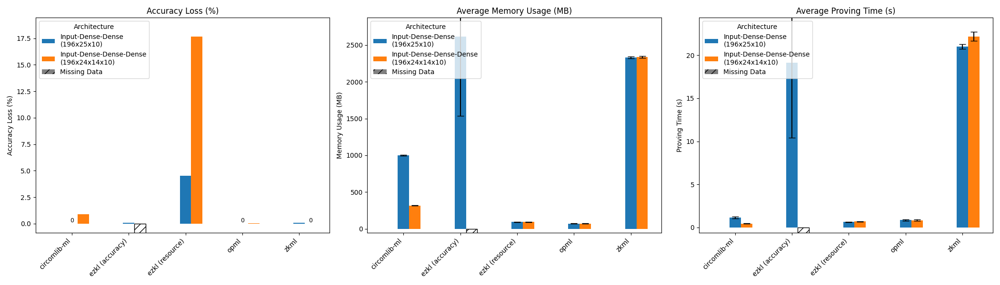
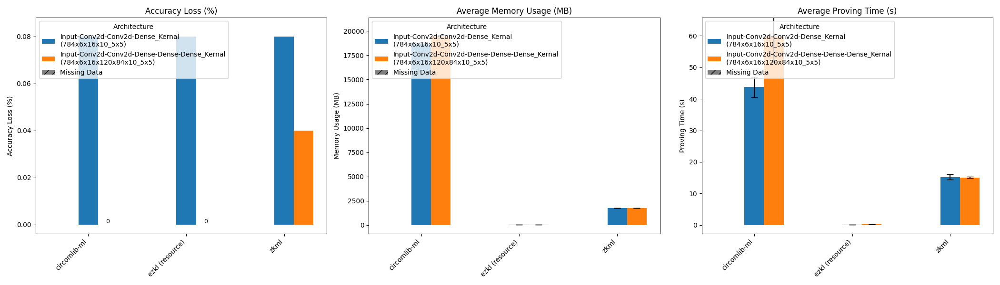
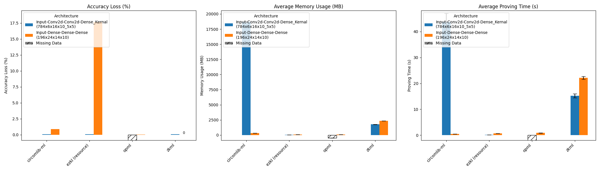

> Disclaimer


# Introduction

As machine learning continues its expansion in the global market, the reliability and integrity of its models have become paramount. This is especially true in the context of Machine Learning as a Service (MLaaS), where there's an inherent need to ensure **model authenticity**, which means guaranteeing that the offered model not only matches its description but also operates within accurate parameters while maintaining a degree of privacy. To achieve this, zk-SNARK (Zero-Knowledge Succinct Non-Interactive Argument of Knowledge) has garnered significant attention. Its ability to produce short proofs, regardless of the size of the input data, makes it a prime candidate for integration with ML frameworks like EZKL and Daniel Kang's zkml. However, the challenge of translating ML models into circuits optimized for zero-knowledge-proof systems is non-trivial, particularly for complex neural networks.

Consequently, progress has been made in crafting custom circuits using existing architectures, like zk-STARK, Halo2, and Plonk2. Although these custom circuits can accommodate the sophisticated operations of modern ML models, they often fall short of being scalable, generalized solutions. This situation presents developers with a dilemma: selecting the framework that best suits their specific needs.

To address this issue, I'm developing a zkML benchmark. This tool is designed to assist developers in understanding the trade-offs and performance differences among various frameworks. While many frameworks offer their own benchmark sets, making direct comparisons is complex due to the numerous variables that affect performance. My approach focuses on establishing uniform conditions across all frameworks to provide a practical and straightforward comparison.

Unlike the existing benchmark [results](https://blog.ezkl.xyz/post/benchmarks/) conducted by the team at EZKL, which focus on traditional machine learning models including Linear Regression, Random Forest Classification, Support Vector Machine (SVM), and Tree Ensemble Regression, our benchmarks analyze selected zkML frameworks with an emphasis on networks that include **deep neural networks** (DNNs) and **convolutional neural networks** (CNNs).

# Benchmark Methodology

The methodology for benchmarking zkML frameworks is meticulously designed to evaluate and compare the performance and capabilities of various zk proof systems for verifiable inference. 

## Primary Metrics

* **Accuracy Loss:** Measures how well the inference generated by each frameworks retains the performance of the original, non-private model. Lower accuracy loss is preferable.

* **Memory Usage:** Tracks the peak memory consumption during proof generation, indicating the system's resource demand.

* **Proving Time:** The time required by each framework to generate a proof, essential for gauging the proof system's efficiency. Note: Proof verification time is considered beyond the scope of this analysis.

* **Framework Compatibility:** Assesses each framework's ability to work with various ML model formats and operators.

## Selected Frameworks:

- **EZKL (Halo 2)**
- **ZKML (Halo 2)**
- **circomlib-ml (R1CS Groth16)**
- **opML (Fraud Proof)**

These frameworks were selected based on criteria such as GitHub popularity, the proof system used, and support for different ML model formats. This variety ensures a broad analysis across distinct zk proof systems.

> Note on Orion Exclusion: The proof generation process for Orion, developed by Gizatech, is executed on the Giza platform. Due to this, the memory usage and time cost metrics during proof generation are not directly comparable with those of other frameworks evaluated in this study. As a result, to maintain the integrity and comparability of our benchmarking analysis, Orion's benchmark results will be excluded from the subsequent sections.

## Benchmarking Tasks

Our benchmarking methodology involves tasks on the MNIST dataset for evaluating frameworks under varying complexity levels:

* **MNIST Dataset:**
    - Simplicity of Task: The MNIST dataset, comprising handwritten digits, serves as a benchmark for assessing the basic capabilities of zkML frameworks.
    - Framework Assessment: This task will gauge how each framework manages simple image data in terms of maintaining accuracy and operational efficiency.
    - Parameter Variation: I will test the frameworks on this dataset with an increasing number of parameters and layers, pushing the boundaries of each framework's capacity.


## Benchmarking Process

The benchmarking process for evaluating zkML frameworks is designed to offer a thorough analysis of their performance across various metrics. Below is a detailed outline of the steps involved.

1. **Neural Network Design:** 
    * I meticulously craft the structure of networks ranging from 3-layer DNNs to 6-layer CNNs. This is to assess each framework's ability to efficiently translate Multi-Layer Perceptrons (MLPs) into zk circuits, focusing on both the transpilation process and its efficiency.

2. **Uniform Testing Conditions:** 
    * Given the diversity in zkML framework compatibilities, with some frameworks exclusively supporting TensorFlow or PyTorch, establishing uniform testing conditions extends beyond merely standardizing the MLP structures. To facilitate direct and fair performance comparisons, a crucial step involves the unification of model representations across TensorFlow and PyTorch ecosystems. This harmonization ensures that the benchmarks accurately reflect each framework's capabilities under comparable conditions.
    * Recognizing the challenges posed by existing tools, such as the ONNX framework, which often fails to seamlessly convert models between TensorFlow and PyTorch, I have undertaken a manual approach. This entails defining identical neural network architectures within each framework's preferred environment and meticulously transferring weights and biases in a manner that aligns with the computational paradigms of both TensorFlow and PyTorch. For instance, weights in PyTorch are transposed before being applied to the input matrix, a step that necessitates careful handling to preserve the integrity of the model's computational logic. This meticulous process not only facilitates the assessment of proving time and memory usage across frameworks but also enables a more nuanced evaluation of accuracy loss, thereby ensuring that comparisons between zkML frameworks are both fair and meaningful.

3. **Exclusion of Pre-Processing Steps:** 
    * Our measurements concentrate exclusively on the proof generation phase, deliberately omitting data pre-processing or trusted-setup steps to maintain a focused evaluation of proof generation efficiency.


4. **Comparative Performance Analysis:** 
    * Performance is compared both horizontally and vertically, examining the impact of variations in MLP structure on critical metrics like proof generation time and memory usage within a single framework, as well as comparing the performance of different frameworks on the same MLP structure.


5. **Highlight Differences:** 
    * We clearly delineate performance distinctions and capabilities across the various proving systems. This includes comprehensive insights on each system's response to diverse benchmarking tasks and conditions, especially with modified MLP architectures.


Through this detailed benchmarking process, this project aims to provide a nuanced understanding of each zkML framework’s capabilities, especially in handling increasingly complex machine learning models. This approach will guide users in selecting the most suitable framework for their specific requirements in the realm of zkML.

# Architecture Overview
Before delving into the benchmark results, let's review the tested models.

## DNN
The initial testing network consists of Deep Neural Networks (DNN), each with an input layer followed by two or three fully connected dense layers. The nomenclature for each model is derived from the size of its layers, separated by underscores ('_').

For example, the model named "784_56_10" denotes an input size of 784 (corresponding to MNIST dataset images, which are 28x28 pixels in grayscale), followed by a dense layer with 56 units, and ending with an output layer designed for 10 distinct classes. Models "196_25_10" and "196_24_14_10" are tested with reduced input sizes to evaluate performance across varying layers and parameters.

The detailed structure for the model "784_56_10" is as follows:

```plaintext
Model: "784_56_10"
_________________________________________________________________
Layer (type)                Output Shape              Param #   
=================================================================
input_1 (InputLayer)        [(None, 784)]             0         
dense (Dense)               (None, 56)                43,960     
dense_1 (Dense)             (None, 10)                570       
=================================================================
Total params: 44,530 (173.95 KB)
Trainable params: 44,530 (173.95 KB)
Non-trainable params: 0 (0.00 Byte)
_________________________________________________________________
```

### Specifications

| Model         | Trainable Parameters | Accuracy on MNIST |
|---------------|----------------------|-------------------|
| `784_56_10`   | 44,530               | >97.40%           |
| `196_25_10`   | 5,185                | >95.41%           |
| `196_24_14_10`| 5,228                | >95.56%           |

## CNN
CNN models are fundamentally different from DNN models, starting with their initial approach that begins with the input shape's dimensions. These models employ Conv2D and AvgPooling2D layers to diminish spatial dimensions prior to flattening. The nomenclature for CNN models commences with a single dimension of the input shape, such as 28 or 14, followed by the specifications for the Conv2D layers, and concludes with the output layer designed for classification. The last value denotes the kernel size of the Conv2D layers.

For instance, the CNN network '28_6_16_10_5' signifies an input size of 28x28, followed by two Conv2D layers with sizes 6 and 16, respectively. After the flatten layer processes the input from the previous layer (256), it outputs a 10-class inference. The '_5' at the end specifies that the Conv2D layers have a '5x5' kernel size.

Below is the detailed structure for the model '28_6_16_10_5':

```
Model: "28_6_16_10_5"
_________________________________________________________________
Layer (type)                Output Shape              Param #   
=================================================================
input_1 (InputLayer)        [(None, 28, 28, 1)]       0         
conv2d (Conv2D)             (None, 24, 24, 6)         156       
re_lu (ReLU)                (None, 24, 24, 6)         0         
average_pooling2d (AveragePooling2D) (None, 12, 12, 6) 0         
conv2d_1 (Conv2D)           (None, 8, 8, 16)          2416      
re_lu_1 (ReLU)              (None, 8, 8, 16)          0         
average_pooling2d_1 (AveragePooling2D) (None, 4, 4, 16) 0         
flatten (Flatten)           (None, 256)               0         
dense (Dense)               (None, 10)                2570      
=================================================================
Total params: 5,142 (20.09 KB)
Trainable params: 5,142 (20.09 KB)
Non-trainable params: 0 (0.00 Byte)
_________________________________________________________________
```

### Specifications

The following table outlines the specific details and performance metrics of each CNN model tested:

| Model                 | Trainable Parameters | Accuracy on MNIST |
| --------------------- | -------------------- | ----------------- |
| `28_6_16_10_5`        | 5,142                | >98.66%           |
| `14_5_11_80_10_3`     | 4,966                | >97.07%           |
| `28_6_16_120_84_10_5` | 44,426               | >98.72%           |

Each model was evaluated on the MNIST testing dataset, which includes 10,000 images, to determine its accuracy.


# Results and Analysis
This benchmark utilized four primary metrics: accuracy loss, memory usage, proving time, and framework compatibility. Although the first three metrics can be quantified and compared with each other, a challenge remains in determining if one framework significantly outperforms another. For instance, a framework might achieve nearly zero accuracy loss but at the cost of impractical memory usage and proving time. To address this, I normalized the results of each framework tested on the same model and plotted these results using radar charts. This approach provides readers with a clearer understanding of each framework's performance across these three metrics.

It's important to note that this methodology implies treating accuracy loss, memory usage, and proving time as equally important, which may not always be practical in real-world scenarios. Therefore, readers are also encouraged to consult the bar charts provided in subsequent sections. These charts are designed to help developers comprehend the trade-offs and performance differences among the various frameworks, offering a more nuanced view of each framework's strengths and weaknesses.

## Performance on DNN & CNN Models

We have used consistent colors to plot the performance of each framework across all six tested neural networks, with details provided in the legends. The results from the benchmarks have been normalized, with the best-performing framework in each metric scoring 1.0 on the radar chart. Therefore, the larger the area of the triangle formed by the normalized data on accuracy loss, memory usage, and proving time, the better the framework's performance.

> Please ref to [link](https://github.com/Guy1m0/ZKML-Benchmark/blob/main/benchmarks/benchmark_results.csv) for the complete benchmark results.

### Performance on DNN Models


From the above three radar charts, it is evident that both opML and Circomlib-ML stand out in the benchmarks. opML prioritizes proving time and memory usage without sacrificing much accuracy, while Circomlib-ML offers the best accuracy loss with acceptable proving time and memory usage for generating proofs in zkML.

> **Note on EZKL:** EZKL offers two modes - 'accuracy,' which aims to minimize accuracy loss using a larger scaling factor, and 'resource,' which is optimized for resource-constrained systems, achieving acceptable accuracy loss with good efficiency.

> **Caveat:** The 'accuracy' mode of EZKL, when benchmarked on the model '196_24_14_10', causes a system crash due to exceeding 128 GB memory requirements. I have excluded this test set from our benchmark and will include it in a future update once the issue is resolved.

### Performance on CNN Models


As opML currently does not support the Conv2d operator, only three frameworks are included in this set of benchmarks. The charts clearly indicate that EZKL, even in 'resource' mode, dominates this testing suite across all three metrics.

## Analysis on Key Factors
To better understand the performance results on these 6 different models, a close examination of the impact of variations in structures on metrics like accuracy loss and memory usage has been conducted. Total 5 key factors have been chosen to test how this variation will lead to.

### Numbers of Layers in DNN



### Numbers of Parameters in DNN


### Adding Dense Layers in CNN


### Conv2D over Dense Layer


### Others

CNN to DNN


> Most complicated models


# Summary

